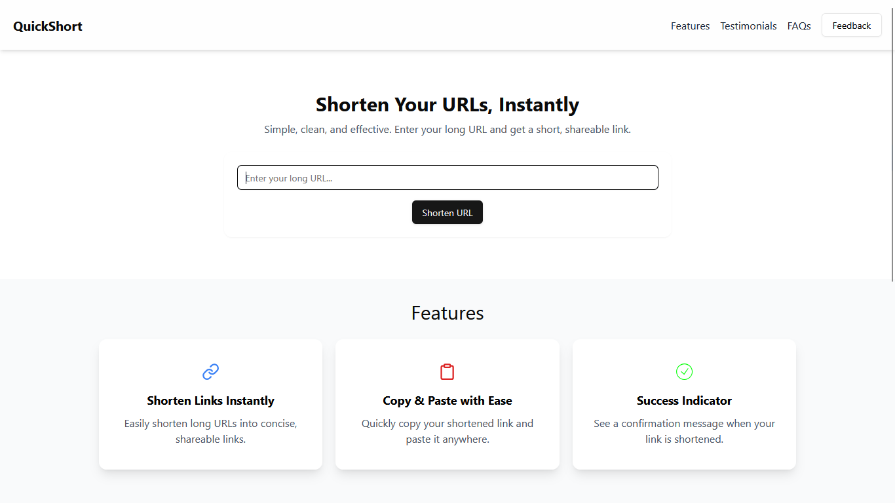

<div align="center">
  <br />
    <a href="https://quickshort-ten.vercel.app" target="_blank">
      
    </a>
  <br />
  <div>
    
    
    
    
    
  
  </div>
  <h3 align="center">QuickShort - Tiny Links, Big Impact! 🚀</h3>

   <div align="center">
        A simple and efficient URL Shortener App built using the MERN (MongoDB, Express.js, React.js, Node.js) stack. This application allows users to shorten long URLs and redirect to the original URL when accessing the shortened link.
    </div>
    
</div>

## 📋 Table of Contents

1. 🕸️ [Features](#-features)
2. ⚙️ [Tech Stack](#️-tech-stack)
3. 📂 [Project Structure](#️-project-structure)
4. 🤸 [Quick Start](#-getting-started)
5. 🔗 [API Endpoints](#-api-endpoints)
6. 🔭 [Deployment](#-deployment)
7. 🪴 [Future Enhancements](#-future-enhancements)
8. 🤝 [Contributing](#-contributing)
9. 📄 [License](#-license)
10. 📩 [Contact](#-contact)

## 🚀 Features

- 🔗 Shorten long URLs with a unique identifier
- 🚀 Instant redirection to the original URL
- 📊 Track the number of clicks for each shortened link
- 🌐 Responsive and user-friendly UI
- 🎨 Styled with Tailwind CSS

## 🛠️ Tech Stack

### **Frontend**

- React.js (Vite for fast development)
- Tailwind CSS (for modern UI styling)
- React Query (for state management)
- Axios (for API requests)

### **Backend**

- Node.js & Express.js (REST API)
- MongoDB & Mongoose (Database & Schema management)
- nanoid (for generating unique short URLs)
- dotenv & cors (environment configuration & cross-origin handling)

## 🏗️ Project Structure

```ts
/url-shortener
 ├── client/        (React.js Frontend)
 ├── server/        (Express.js Backend)
 ├── public/        (Static Assets)
 ├── package.json   (Project Dependencies)
 ├── .gitignore     (Git Ignore File)
 ├── LICENSE        (Project License)
 ├── README.md      (Project Documentation)
```

## 🤸 Getting Started

Follow these steps to set up the project locally on your machine.

**Prerequisites**

Make sure you have the following installed on your machine:

- [Git](https://git-scm.com/) - for version control
- [Node.js](https://nodejs.org/en/) - for running JavaScript on the server
- [pnpm](https://www.pnpm.io/) - for package management

### 1️⃣ Clone the Repository

```sh
git clone https://github.com/your-username/quickshort.git
cd quickshort
```

### 2️⃣ Backend Setup (Node.js & Express)

```sh
cd server
pnpm install
```

#### 🔹 Create a `.env` file in the `server/` directory

```ts
CLIENT_API = <your_frontend_api_url>;
SERVER_API = <your_backend_api_url>;
MONGO_URI = <your_mongodb_connection_string>;
PORT = 5000;
```

#### 🔹 Start the Backend Server

```sh
pnpm dev
```

### 3️⃣ Frontend Setup (React.js)

```sh
cd ../client
pnpm install
```

#### 🔹 Create a `.env` file in the `client/` directory

```ts
VITE_SERVER_API = <your_backend_api_url>;
```

#### 🔹 Start the Frontend Server

```sh
pnpm dev
```

### 4️⃣ Open the App

Visit: [http://localhost:5173](http://localhost:5173)

## 📌 API Endpoints

### 1️⃣ **Shorten a URL**

**POST** `/short`

```json
{
  "longUrl": "https://example.com"
}
```

**Response:**

```json
{
  "shortUrl": "http://localhost:5000/abc1234"
}
```

### 2️⃣ **Redirect to Original URL**

**GET** `/:shortId`

When visiting `http://localhost:5000/abc1234`, it redirects to `https://example.com`.

## 🌍 Deployment

- **Frontend**: Vercel
- **Backend**: Render
- **Database**: MongoDB Atlas

## 🔥 Future Enhancements

✅ Add User Authentication (JWT) </br>
✅ Allow Custom Short URLs </br>
✅ Track Click Analytics </br>
✅ Create a Dashboard for Managing URLs

## 🙌 Contributing

Contributions are welcome! Please feel free to submit a Pull Request.

To contribute:

Fork the repository </br>
Create your feature branch (`git checkout -b feature/your-feature`) </br>
Commit your changes (`git commit -m 'feat: add your feature'`) </br>
Push to the branch (`git push origin feature/your-feature`) </br>

## 📜 License

This project is licensed under the Apache License - see the [LICENSE](LICENSE) file for details.

## 📩 Contact

For any questions or suggestions, feel free to reach out at [laxmanrathod.dev@gmail.com](mailto:laxmanrathod.dev@gmail.com).
